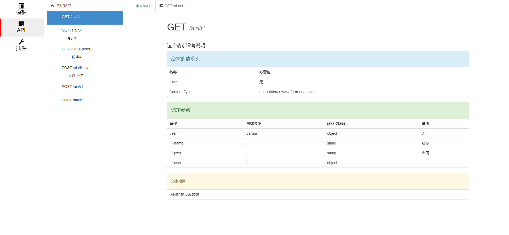

## 说明

AIA(全名Auto Interface Archive 自动接口文档， 以下称AIA)，使用Java DOC为参数提供说明，这意味着你不用使用注解来进行这些烦人的配置。通过生成的Api，创建调用模板，进行请求，它们在你重启系统后同样存在。通过模板链来进行一系列请求，模拟用户遇到的情况。插件可以完成一些重复或额外的功能，比如：认证、将Api生成PDF或者获取开放平台的token。
 

## 模块

- core: 主要的功能实现
- page-ui: 页面
- samples: 示例
- spring-boot-web-starter: spring boot支持
- spring-web: spring web支持

## 主要功能

- api：接口；请求头、参数、执行url
  - definition：定义，解析接口方法的注释
  - mgt：api的管理和存储
- model: 接口模型解析，解析接口参数和返回值
- plugin: 插件，定义、管理和存储
- security: 安全，定义解析接口白名单
- template: 模板，生成、管理和存储
- cache: 缓存，安全的内存管理、持久化
- openapi3：支持openapi3

## 页面展示
调用模板

Api

# 功能还在开发中。。。